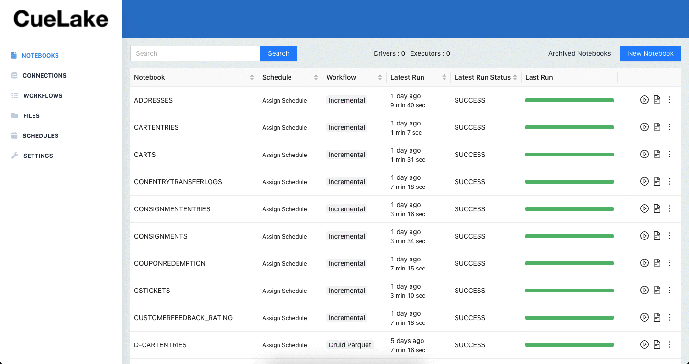

[](https://codeclimate.com/github/cuebook/cuelake/maintainability)


# CueLake
CueLake does the `EL` in `ELT` (Extract, Load, Transform) pipelines to a **data lakehouse**.

You write simple select statements to extract incremental data and schedule these statements. CueLake uses **Spark SQL** to execute these statements against your databases and then merges incremental data into your data lakehouse (powered by **Apache Iceberg**).

CueLake uses **Apache Zeppelin** to auto start and stop the Spark cluster. For every scheduled run, CueLake starts the Spark cluster, loads incremental data into the lakehouse, and then shuts down the cluster.




# Getting started
CueLake uses Kubernetes `kubectl` for installation. Create a namespace and then install using the `cuelake.yaml` file. Creating a namespace is optional. You can install in the default namespace or in any existing namespace.

In the commands below, we use `cuelake` as the namespace.
```
kubectl create namespace cuelake
kubectl apply -f https://raw.githubusercontent.com/cuebook/cuelake/main/cuelake.yaml -n cuelake
kubectl port-forward services/lakehouse 8080:80 -n cuelake
```

Now visit [http://localhost:8080](http://localhost:8080) in your browser.

If you don’t want to use Kubernetes and instead want to try it out on your local machine first, we’ll soon have a docker-compose version. Let us know if you’d want that sooner.

# Features
* **Upsert Incremental data.** CueLake uses Iceberg’s `merge into` query to automatically merge incremental data.
* **Elastically Scale Cloud Infrastructure.** CueLake uses Zeppelin to auto create and delete Kubernetes resources required to run data pipelines.
* **In-built Scheduler** to schedule your pipelines.
* **Automated maintenance of Iceberg tables.** CueLake does automated maintenance of Iceberg tables -  expires snapshots, removes old metadata and orphan files, compacts data files.
* **Monitoring.**  Get Slack alerts when a pipeline fails. CueLake maintains detailed logs.
* **Data Security.** Your data always stays within your cloud account.

### Current Limitations
* Supports relational databases (Oracle, MySQL, Postgres) as data source. More sources will be added later.
* Supports AWS S3 as a destination. Support for ADLS and GCS is in the roadmap.
* Uses Apache Iceberg as an open table format. Delta support is in the roadmap.
* Uses AWS Glue as the catalog implementation. Hive support is in the roadmap.
* Uses Celery for scheduling jobs. Support for Airflow is in the roadmap.

# Support
For general help using CueLake, read the [documentation](https://cuelake.cuebook.ai/), or go to [Github Discussions](https://github.com/cuebook/cuelake/discussions).

To report a bug or request a feature, open an [issue](https://github.com/cuebook/cuelake/issues).

# Contributing
We'd love contributions to CueLake. Before you contribute, please first discuss the change you wish to make via an [issue](https://github.com/cuebook/cuelake/issues) or a [discussion](https://github.com/cuebook/cuelake/discussions). Contributors are expected to adhere to our [code of conduct](https://github.com/cuebook/cuelake/blob/main/CODE_OF_CONDUCT.md).
