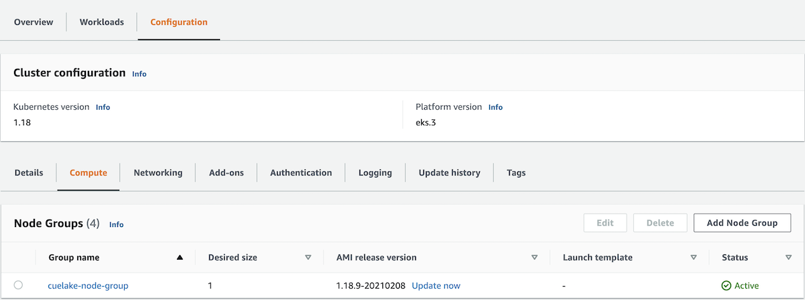

# Getting started
## Install CueLake
CueLake uses Kubernetes `kubectl` for installation. Create a namespace and then install using the `cuelake.yaml` file. Creating a namespace is optional. You can install in the default namespace or in any existing namespace.

In the commands below, we use `cuelake` as the namespace.

```
kubectl create namespace cuelake
kubectl apply -f https://raw.githubusercontent.com/cuebook/cuelake/main/cuelake.yaml -n cuelake
kubectl port-forward services/lakehouse 8080:80 -n cuelake
```

To test if the installation is successful, run the following command
```
kubectl get pods -n cuelake
```

You should see 3 pods in running status, something like below:
```
NAME                               READY   STATUS    RESTARTS   AGE
lakehouse-74cd5d759b-8pj5c         1/1     Running   0          1m
redis-69cc674bf8-rsd74             1/1     Running   0          1m
zeppelin-server-865974dc55-rt9vg   3/3     Running   0          1m
```

Now visit [http://localhost:8080](http://localhost:8080) in your browser.

If you don’t want to use Kubernetes and instead want to try it out on your local machine first, we’ll soon have a docker-compose version. Let us know if you’d want that sooner.

## Add Connection
1. Go to the Connections screen.
2. Click on `New Connection`.
3. Select your source database type.
4. Enter your access credentials and click `Add Connection`.

## Configure AWS
### Provide access to S3
In your AWS console, go to Elastic Kubernetes Service.


Choose your cluster and go to the Configuration tab. Under Configuration, go to the Compute tab.



Select your Node Group. Click on the `Node IAM Role ARN` to go to the IAM Roles screen.


Attach `AmazonS3FullAccess` policy.

### Setup S3 buckets
In your AWS console, create a new S3 bucket. CueLake will use this bucket to store Iceberg and Spark tables.

Next setup this S3 bucket as the warehouse location in Spark.
Go to the Settings screen in CueLake and click on Interpreter Settings tab. Search for **spark** interpreter. In the spark interpreter, click on `edit`.


Go to the bottom of the paragraph. Enter the S3 bucket path in two properties as below.
`spark.sql.warehouse.dir` property is used for Spark tables. `spark.sql.catalog.cuelake.warehouse` property is used for iceberg tables.

```
spark.sql.warehouse.dir	                s3a://<YourBucketName>/warehouse
spark.sql.catalog.cuelake.warehouse	    s3a://<YourBucketName>/cuelake
```

Click `Save` and restart the interpreter.

## Add New Notebook
1. Go to the Notebooks screen and click on `New Notebook`
2. Select `Incremental Refresh` template
3. Select the Source Connection
4. Enter the SQL Select statement
5. In the Timestamp column, enter the column name of the incremental column. This must be of data type Timestamp. 
6. Enter the Primary Key Column 
7. Enter a name for the destination table.
8. Give a name to the notebook and click `Create Notebook`.


Now Run the notebook. This will create a new iceberg table in your S3 bucket. Note that first run will load the historical data as defined in the SQL query. 

Once the run is successful, you can query data from the newly created table. Go to the Notebooks screen and click on `New Notebook`. Select `Blank` template, give a name to the notebook and click `Create Notebook`. In the Notebooks screen, click the `Notebook` icon for your notebook to open the Zeppelin notebook. Your iceberg table can be queried as `cuelake.<your-destination-table-name>`.

### Merge Incremental data
To upsert incremental data into your S3 table, run the above notebook again, after a few rows have been inserted or updated.
To confirm that merge is successful, query the S3 table.
