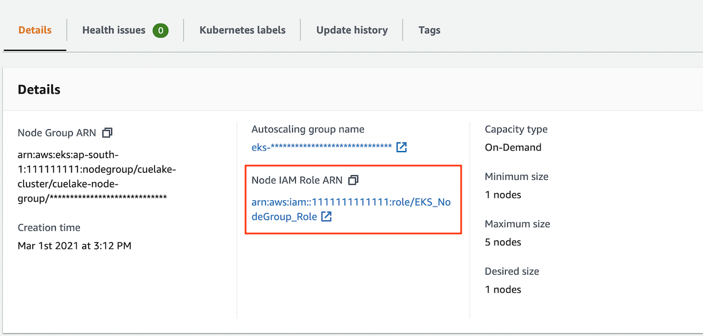

# Getting started
## Install CueLake
CueLake uses Kubernetes `kubectl` for installation. Create a namespace and then install using the `cuelake.yaml` file. Creating a namespace is optional. You can install in the default namespace or in any existing namespace.

In the commands below, we use `cuelake` as the namespace.

```
kubectl create namespace cuelake
kubectl apply -f https://raw.githubusercontent.com/cuebook/cuelake/main/cuelake.yaml -n cuelake
kubectl port-forward services/lakehouse 8080:80 -n cuelake
```

To test if the installation is successful, run the following command
```
kubectl get pods -n cuelake
```

You should see 3 pods in running status, something like below:
```
NAME                               READY   STATUS    RESTARTS   AGE
lakehouse-74cd5d759b-8pj5c         1/1     Running   0          1m
redis-69cc674bf8-rsd74             1/1     Running   0          1m
zeppelin-server-865974dc55-rt9vg   3/3     Running   0          1m
```

Now visit [http://localhost:8080](http://localhost:8080) in your browser.

If you don’t want to use Kubernetes and instead want to try it out on your local machine first, we’ll soon have a docker-compose version. Let us know if you’d want that sooner.

## Add Connection
1. Go to the Connections screen.
2. Click on `New Connection`.
3. Select your source database type.
4. Enter your access credentials and click `Add Connection`.

## Configure AWS
### Provide access to S3 and Glue
In your AWS console, go to Elastic Kubernetes Service.


Choose your cluster and go to the Configuration tab. Under Configuration, go to the Compute tab.


Select your Node Group. Click on the `Node IAM Role ARN` to go to the IAM Roles screen.



Attach two policies - `AmazonS3FullAccess` and `AWSGlueConsoleFullAccess`

### Create Glue database
1. In your AWS console, go to AWS Glue.
2. Click on Databases in the left menu.
3. Click on Add database to create a database named "**cuelake**".

## Add New Notebook
1. Go to the Notebooks screen and click on `New Notebook`
2. Select `Incremental Refresh` template
3. Select the Source Connection
4. Enter the SQL Select statement
5. In the Timestamp column, enter the column name of the incremental column. This must be of data type Timestamp. 
6. Enter the Primary Key Column 
7. Enter the complete S3 path for the destination table. The S3 path must end with the name of the destination table.
8. Give a name to the notebook and click `Create Notebook`.


Now Run the notebook. This will create a new table in the specified S3 path. Note that first run will load the historical data as defined in the SQL query. 

Once the run is successful, you can query data from the newly created table in S3. Click the `Query` button in the notebook.

### Merge Incremental data
To upsert incremental data into your S3 table, run the above notebook again, after a few rows have been inserted or updated.
To confirm that merge is successful, query the S3 table.
